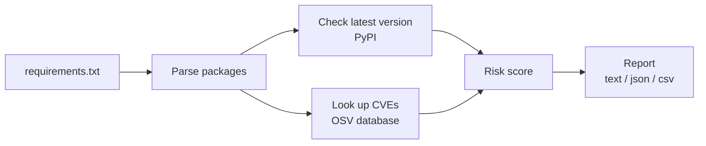
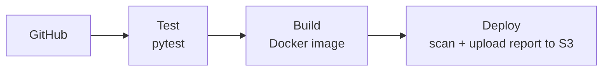

# Dependency Security Analyzer

A small command-line tool that checks a Python `requirements.txt` file and tells you:

- which packages are **outdated**
- which packages have **known vulnerabilities (CVEs)**
- a **risk score** (0–100) and a recommendation for each package

It is also a hands-on **DevOps project**: the tool is tested and packaged automatically with **Jenkins**, runs in **Docker** and **Kubernetes**, and publishes its reports to **AWS S3** created with **Terraform**.

---

## How it works



---

## Example output

```
Package      Version    Latest     Status     CVEs  Risk
----------------------------------------------------------------------
django       2.2.0      6.1.1      OUTDATED   75    100
requests     2.18.0     2.34.2     OUTDATED   10    100
flask        0.12       3.1.3      OUTDATED   8     100
```

The sample file `examples/vulnerable-requirements.txt` uses old package versions on purpose, so you can see the tool find problems.

---

## Quick start

### Option 1: Run with Docker (easiest)

```bash
docker build -t dep-analyzer .
docker run --rm dep-analyzer --file examples/vulnerable-requirements.txt
```

### Option 2: Run with Python

```bash
pip install -r requirements.txt
python main.py --file examples/vulnerable-requirements.txt
```

### Output formats

```bash
python main.py --file examples/vulnerable-requirements.txt --output text   # default
python main.py --file examples/vulnerable-requirements.txt --output json
python main.py --file examples/vulnerable-requirements.txt --output csv    # saves report.csv
```

---

## Running the tests

```bash
pip install -r requirements-dev.txt
pytest
```

There are 29 unit tests covering the parser, CVE lookup, risk scoring and reports. The OSV API is mocked, so tests run offline.

---

## CI/CD pipeline (Jenkins)

Every build runs three stages:



| Stage | What it does |
|---|---|
| **Test** | Installs dependencies and runs all unit tests. If a test fails, the pipeline stops. |
| **Build** | Builds the Docker image. |
| **Deploy** | Runs a scan and uploads the JSON report to S3 as `report-<build number>.json`. |

The pipeline is defined in [`Jenkinsfile`](Jenkinsfile). Jenkins itself runs in Docker, using the image in [`jenkins/Dockerfile`](jenkins/Dockerfile).

---

## Kubernetes

The scanner runs as a Kubernetes **Job** (a task that runs once and finishes):

```bash
kubectl apply -f k8s-job.yaml
kubectl logs job/dep-scan
```

To run it again, delete the old job first:

```bash
kubectl delete job dep-scan
kubectl apply -f k8s-job.yaml
```

Tested on the Kubernetes cluster built into Docker Desktop (kubeadm).

---

## AWS + Terraform

[`terraform/main.tf`](terraform/main.tf) creates the S3 bucket that stores scan reports.

```bash
cd terraform
terraform init
terraform plan
terraform apply
```

---

## Security choices

- **Non-root container**: the Docker image runs as a normal user, not root.
- **No secrets in code**: AWS keys are stored in Jenkins Credentials, never in the Jenkinsfile or Git.
- **Least privilege**: Jenkins uses an IAM user that only has S3 access.
- **Terraform state is not committed**: `.tfstate` files are in `.gitignore` because they can contain sensitive data.

---

## Project structure

```
dependency-security-analyzer/
├── main.py                  # entry point (command-line options)
├── parser.py                # reads requirements.txt
├── version_checker.py       # finds the latest version on PyPI
├── cve_lookup.py            # looks up vulnerabilities in OSV
├── risk_scorer.py           # calculates the risk score
├── reporter.py              # prints / exports the report
├── test_*.py                # unit tests
├── examples/
│   └── vulnerable-requirements.txt
├── Dockerfile               # packages the tool
├── Jenkinsfile              # CI/CD pipeline
├── jenkins/Dockerfile       # Jenkins image with Python, Docker and AWS CLI
├── k8s-job.yaml             # Kubernetes Job
└── terraform/main.tf        # AWS S3 bucket
```

---

## Things I learned (troubleshooting notes)

- **Interactive prompts break automation.** The report asks "search for a CVE? (y/n)" at the end. In Docker, Jenkins and Kubernetes nobody can type an answer, so the program now treats "no input" as "n".
- **Kubernetes would not start** in Docker Desktop. The cause was that WSL was using cgroup v1, which new Kubernetes versions no longer accept. Switching WSL to cgroup v2 fixed it.
- **Git Bash on Windows rewrites paths** like `/var/...` in Docker commands. Adding `MSYS_NO_PATHCONV=1` in front of the command stops this.

## Real-World Test Results

Tested in October 2026 against three open-source Python projects. Input files are in [`real_tests/`](real_tests/).

| Project | Type | Packages | Outdated | Unique Vulnerabilities | High-Risk Packages (score ≥ 70) | Scan Time |
|---|---|---|---|---|---|---|
| [PyGoat](https://github.com/adeyosemanputra/pygoat) | Intentionally vulnerable Django app (OWASP) | 34 | 31 | 139 | 9 | 12.4 s |
| [DVPWA](https://github.com/anxolerd/dvpwa) | Intentionally vulnerable Python web app | 18 | 17 | 55 | 3 | 7.0 s |
| [Freqtrade](https://github.com/freqtrade/freqtrade) | Actively maintained trading bot | 45 | 12 | 0 | 0 | 22.7 s |
| **Total** | | **97** | **60** | **194** | **12** | **~42 s** |

The maintained project returned no known vulnerabilities, which shows the scanner does not raise false alarms on up-to-date dependencies.

### Bugs found and fixed through testing
- **Post-release versions:** `python-dateutil==2.9.0.post0` was parsed as `2.9.0.` and crashed the version check. Replaced the regex parser with `packaging.requirements`, which also handles extras, environment markers, and inline comments.
- **Duplicate vulnerabilities:** OSV can return the same issue under both a PYSEC and a GHSA ID, which doubled the count and inflated risk scores. Results are now deduplicated by CVE ID.

### Known limitation
About a third of findings show `UNKNOWN` severity because the scorer currently reads only `CVSS_V3`. Supporting `CVSS_V4` and GHSA severity labels is planned.

### Reproduce
```bash
python main.py --file real_tests/pygoat.txt --output json > real_tests/pygoat.json
```
